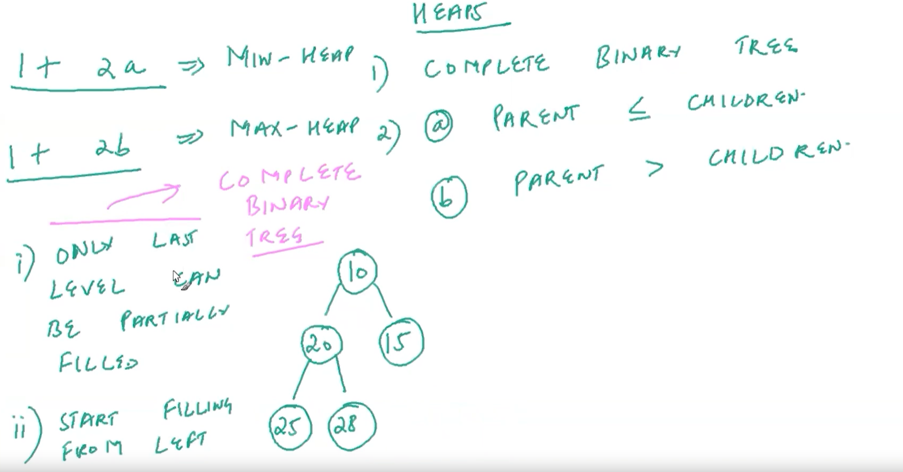

# HEAPS-DSA
Heaps-javascript

| No.| Questions                                                                                                                                                                   |
| ---| ----------------------------------------------------------------------------------------------------------------------------------------------------------------------------------------------------------------------------------------------------------------------|
|    | **Heaps-concepts**                                                                                                                                                          |                                                                                                                                                                    
| 1  | [What-are-heaps-and-why-are-they-used](#)                                                                                                                                   |
| 2  | [Why-are-heaps-complete-binarytree](#)                                                                                                                                      |
| 3  | [Heap-Insertion](#)                                                                                                                                                         |
| 4  | [Heap-insertion-implemention](#)                                                                                                                                            |
| 5  | [Heap-deletion](#)                                                                                                                                                          |
| 6  | [Heap-delection-implementation](#)                                                                                                                                      |
| 7  | [Heap-with-custom-comparator](#)                                                                                                                                        |
| 8  | [Heapify](#)                                                                                                                                                            |
| 9  | [Array-implementatio-of-heads](#)                                                                                                                                                                              | 

| 1  | [What-are-heaps-and-why-are-they-used](#)   

# Heaps-how-they-are-used

<li> Suppose if child node is greater then parent node that is "P ≤ C" </li>

<li> suppose if parent node is greater than child node that is "p > C" </li>

  

| 2  | [Why-are-heaps-complete-binarytree](#) 

| 3| [Heap-Insertion](#)  

# Heaps-Insertion.

<!--
<li></li>

<ul>
  
<li>
<li></li>

</ul>

<ol>
<li></li>
<li>
</li>

<ul>
  
  <color🔤>blue</color🔤>
  <color> blue </color>
  <con>
  
  </con>
  <bright color: blue :: green ></bright>
<height :150 px
width : 90px >
container

margin 🥦
margin: 
border: yellow; -->

 

  
</ul>

| 4  | [Heap-insertion-implemention](#)   

# Heap-insertion-implemention

| 5  | [Heap-Deletion](#)  

# Heap-deletion

| 6  | [Heap-Deletion-implementation](#)  

# Heap-deletion-implemention

| 7 | [heapwithcustomcomparator](#)   

# Heap-custom-confomatiom

| 8 | [ Heapify](#)

# Heapify

| 9 | [ Array-implementation-of-heads](#)

# Array implementation of heads

#

